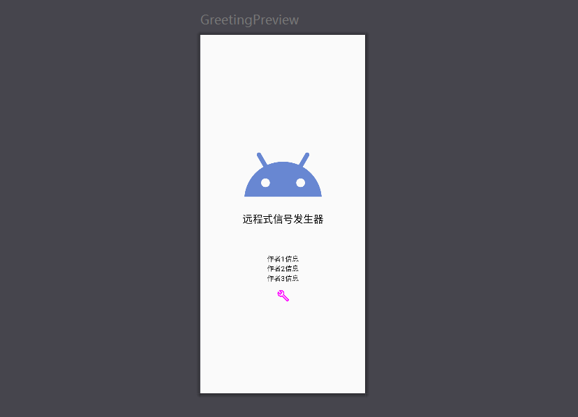
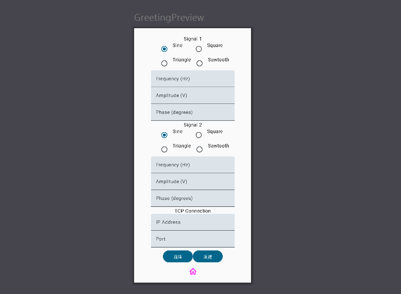

# tcpapp

一个使用Jetpack Compose[^1]，kotlin[^2]开发的简单tcp安卓客户端，实现tcp的连接和波形参数的上传功能。

虽然文件比较多，但大部分是自动生成的。其中最主要的文件就一个**MainActivity.kt**文件（路径为：ddsapptest\app\src\main\java\com\example\ddsapptest）这个文件中的代码，包含了UI界面和交互设计。
预览界面如下：

- 主界面

- 设置界面

>由于作者是名非相关专业的业余大学生，而且学习时间有限，制作出来的软件仅仅是能凑合用，还远达不到理想水准，还请见谅。

[^1]: [官网](https://developer.android.google.cn/jetpack/compose?hl=zh-cn)
Jetpack Compose 是推荐用于构建原生 Android 界面的新工具包。它可简化并加快 Android 上的界面开发，使用更少的代码、强大的工具和直观的 Kotlin API，快速打造生动而精彩的应用。
[^2]:Kotlin是一个基于JVM的新的编程语言，2010年由IntelliJ IDEA所在的JetBrains公司开发，自2012年以来一直开源。 Kotlin可以编译成Java字节码，也可以编译成JavaScript，方便在没有JVM的设备上运行。 Kotlin是面向对象和功能编程功能的JVM和Android的通用、开源、静态的实用的编程语言。 它专注于交互性、安全性及清晰度和工具的支持。
